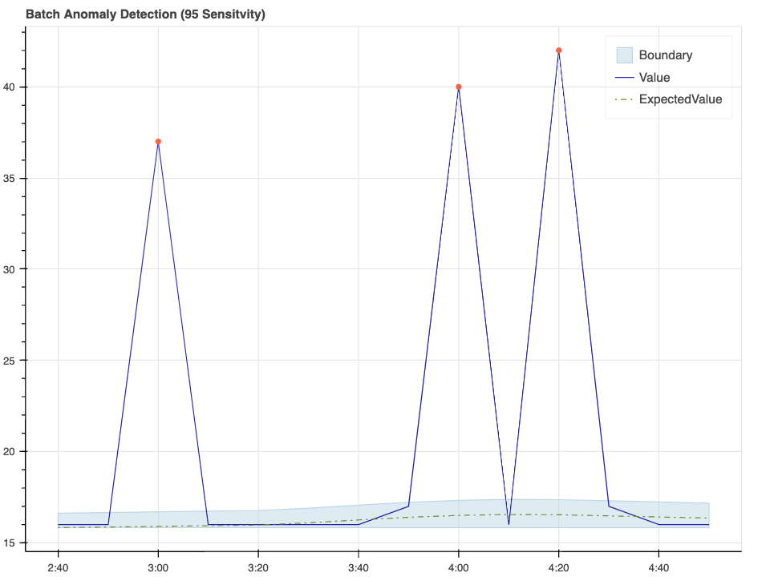

# Detecting anomalies with Azure Anomaly Detection API

In this unit you will run the climate anomaly BASIC application, create an Azure Anomaly Detection API service, and install support for Jupyter Notebooks.

To learn more about Azure Anomaly Detector API, refer to the [Anomaly Detector API Documentation](https://docs.microsoft.com/azure/cognitive-services/anomaly-detector/).

## Generate climate data with anomalies

Climate change is gradual. To generate a climate change data set run the following BASIC application from the Altair web terminal for at **least two hours**. The anomaly application will generate climate data, injecting some some random temperate data which will be detected by the Azure Anomaly Detector API service.

```cpm
mbasic anomaly
```

## Create an Anomaly Detector resource in Azure portal

- Create an Azure subscription if you don't have one - [Create one for free](https://azure.microsoft.com/free/cognitive-services)
- Once you have your Azure subscription, [create an Anomaly Detector resource](https://portal.azure.com/#create/Microsoft.CognitiveServicesAnomalyDetector) in the Azure portal to get your API key and API endpoint.

## Install Jupyter notebook support

Ensure that you have the latest pip; older versions may have trouble with some dependencies:

1. Download and install Python3 from [python.org](https://www.python.org/)

1. Update to the latest pip

    ```bash
    pip3 install --upgrade pip
    ```

1. Install required Python libraries

    ```bash
    pip3 install jupyter pandas numpy bokeh ipywidgets azure.storage.blob matplotlib
    ```

1. Install Visual Studio Code [Python Extension](https://marketplace.visualstudio.com/items?itemName=ms-python.python)

References:

- [Install Jupyter notebook](https://docs.jupyter.org/en/latest/install/notebook-classic.html).

## Open the Anomaly Detector Jupyter Notebook

From Visual Studio Code, open the **Altair8800/AnomalyDetector/AnomalyDetection.ipynb** file.

## Configure the Anomaly Detector Jupyter Notebook

You need to update the following variables in the first Jupyter Notebook cell.

```python
apikey = "REPLACE_WITH_YOUR_AZURE_ANOMALY_DETECTOR_API_KEY"
endpoint = "REPLACE_WITH_YOUR_AZURE_ANOMALY_DETECTOR_API_ENDPOINT"
device_id = "REPLACE_WITH_YOUR_IOT_CENTRAL_DEVICE_ID"
blob_conn_str="REPLACE_WITH_YOUR_STORAGE_ACCOUNT_CONNECTION_STRING"
```

## Run the Anomaly Detector Jupyter Notebook

Select **Run All** from the Jupyter Notebook memu.


The Jupyter Notebook will take approx 2 to 5 minutes to execute depending on how long you have been running the anomaly BASIC application.

When the Jupyter Notebook has completed, a chart similar to the following image will be displayed.



## References

1. [How to spot time-series issues in real-time with Anomaly Detection](https://techcommunity.microsoft.com/t5/ai-cognitive-services-blog/how-to-spot-time-series-issues-in-real-time-with-anomaly/ba-p/3246001)

1. [Identify abnormal time-series data with Anomaly Detector](https://docs.microsoft.com/en-us/learn/modules/identify-abnormal-time-series-data-anomaly-detector/)

1. https://docs.microsoft.com/en-us/learn/modules/identify-abnormal-time-series-data-anomaly-detector/4-exercise-send-data-to-cloud

## Install Azure Storage Explorer

1. Install [Azure Storage Explorer](https://docs.microsoft.com/azure/vs-azure-tools-storage-manage-with-storage-explorer).
1. [Sign in](https://docs.microsoft.com/azure/storage/common/storage-explorer-sign-in) to Storage Explorer
