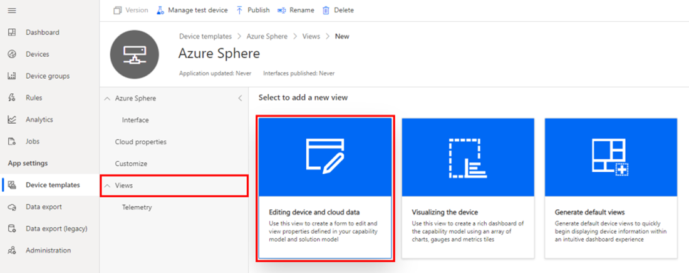
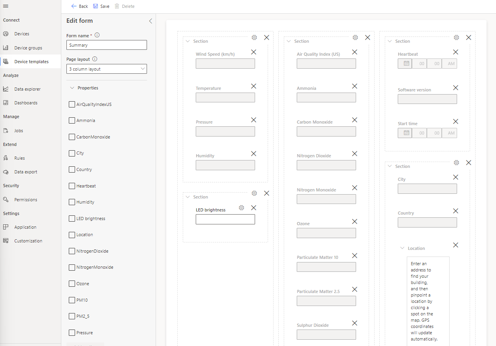
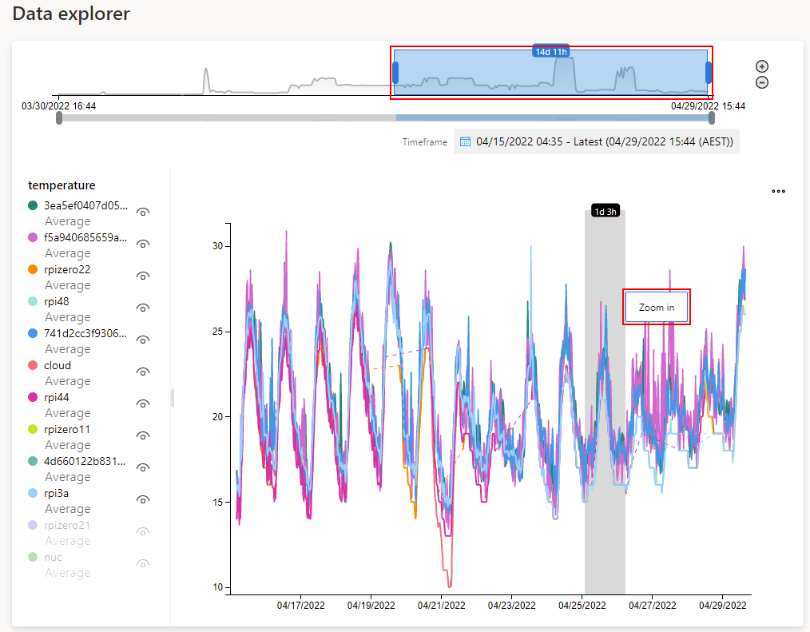

# Customize IoT Central

In this exercise, you will be customizing Azure IoT Central to display the data sent from the applications you run on the Altair emulator. Applications that stream data to Azure IoT Central include WEATHER.BAS and JSON.BAS.

## Open the Azure IoT Central device explorer

1. Go to [Azure IoT Central](https://azure.microsoft.com/services/iot-central?azure-portal=true).

1. On the left pane, select **Devices** select your device.

    It might take a minute or two for the Altair emulator device to register in the devices section of Azure IoT Central.

## Customize the Climate monitor template

The Altair emulator supports [IoT Plug and Play](https://docs.microsoft.com/azure/iot-develop/overview-iot-plug-and-play). When the Altair emulator connects to Azure IoT Central, the Climate Monitor Plug and Play model is loaded from the public repository of models. Default views are created for the Climate Monitor model. These default views are a great starting point, but they need customization along with some new views.

The IoT Plug and Play model is declared in the *main.h* file.

```c
#define IOT_PLUG_AND_PLAY_MODEL_ID "dtmi:com:example:climatemonitor;2"
```

## Add a summary properties view

1. On the left pane, select **Views**, and then select the **Editing device and cloud data** tile.

    

    <!-- :::image type="content" source="../img/iot-central-view-properties-create.png" alt-text="Screenshot that shows the tile for editing device and cloud data."::: -->

1. Name the form **Summary**.
1. Select 3 column layout.
1. Expand **Properties**.

    

    <!-- :::image type="content" source="../img/iot-central-template-properties-select-properties.png" alt-text="Screenshot that shows the controls for expanding and viewing the Properties list."::: -->

1. Select the following properties:
    - Humidity
    - Pressure
    - Temperature
    - Weather
1. Select **Add section**.
1. Drag the newly added section in column 3 to column 1
1. Select the following properties:
    - Heartbeat
    - Software version
    - Start time
1. Select **Add section**.
1. Select the following properties:
    - City
    - Country
    - Location
1. Select **Add section**.

    Your summary page layout should look like the following image.

    

1. Select **Save**.
1. Select **Back**.

## Add a weather data visualization view

1. On the left pane, select **Views**, and then select the **Visualizing the device** tile.

    

    <!-- :::image type="content" source="../img/iot-central-visualize-create.png" alt-text="Screenshot that shows the tile for visualizing the device."::: -->

1. Name the view **Weather**.
1. Select **Line chart** from the **Start with a visual** list, then select **Add tile**.
1. Select the **Size available** icon on the tile and select **3x3**.
1. Select the **Edit** icon on the tile.
1. Name the chart **Weather**.
1. Select **Past 12 hours** from the Display range dropdown list.
1. Select **Capability**.
1. In the capability list, select **temperature**.
1. Select **Capability**.
1. In the capability list, select **pressure**.
1. Select **Capability**.
1. In the capability list, select **humidity**.
1. Select **Capability**.
1. In the capability list, select **Wind speed**.

    <!--  -->

    <!-- :::image type="content" source="../img/iot-central-visualize-tile-capabilities.png" alt-text="Screenshot that the Telemetry section for selecting capabilities."::: -->

1. Select **Update**.
1. Select **Save**.
1. Select **Back**.

## Add a pollution data visualization view

1. On the left pane, select **Views**, and then select the **Visualizing the device** tile.

    

    <!-- :::image type="content" source="../img/iot-central-visualize-create.png" alt-text="Screenshot that shows the tile for visualizing the device."::: -->

1. Name the view **pollution**.
1. Select **Line chart** from the **Start with a visual** list, then select **Add tile**.
1. Select the **Size available** icon on the tile, and select **4x4**.
1. Select the **Edit** icon on the tile.
1. Name the chart **Pollution**.
1. Select **Past 12 hours** from the Display range dropdown list.
1. Select **Capability**.
1. In the capability list, select **aqi**.
1. Repeat adding capabilities, and add the following capabilities.
    1. co (carbon monoxide)
    1. nh3 (ammonia)
    1. no (nitrous oxide)
    1. no2 (nitrous dioxide)
    1. o3 (ozone)
    1. pm10 (particulate matter 10)
    1. pm2_5 (particulate matter 2.5)
    1. so2 (sulphur dioxide)
    1. Wind speed

> Notes. Pollutants produced by vehicle exhausts include carbon monoxide, hydrocarbons, nitrogen oxides, particles, volatile organic compounds, and sulfur dioxide. Hydrocarbons and nitrogen oxides react with sunlight and warm temperatures to form ground-level ozone. Ground-level ozone, a key ingredient in smog, can cause upper respiratory problems and lung damage.

1. Select **Update**.
1. Select **Save**.
1. Select **Back**.

## Customize the LED brightness property

If you have a Raspberry Pi with a Pi Sense HAT then customize the LED Brightness property. You can use this property to set the brightness of the Pi Sense HAT 8x8 LED panel.

1. On the left pane, select **Device templates**
1. On the left pane, select **Customize**, and then expand the **LED brightness** property.

   Update the property by using the information from the following table

   

    | Display&nbsp;name | Initial&nbsp;value | Min.&nbsp;value | Max.&nbsp;value | True&nbsp;name | False&nbsp;name |
    | --- |--- | --- |--- | --- |--- |
    | LED brightness | 2 | 0 | 15 | n/a | n/a |

1. Select **Save**.

### Publish the template

To publish the template to the Azure IoT Central application, select the **Publish** button.


<!-- :::image type="content" source="../img/iot-central-template-publish.png" alt-text="Screenshot of the pane for customizing an interface, with the Publish button."::: -->

## View your Altair emulator device

1. On the left pane, select **Devices**, select the **Climate monitor** template and then select your device.

1. To explore the device views, select the various tabs.

    

    <!-- :::image type="content" source="../img/iot-central-device-tabs.png" alt-text="Screenshot that highlights the available tabs for customizing your device properties."::: -->

## Explore climate data from IoT Central

You can explore and analyze data from Azure IoT Central. 

1. On the left pane, select **Data explorer**.
1. Select the **+ New Query**.
1. Select the Climate monitor **Device group**.
1. Select the temperature **Telemetry**.
1. Select **Group by** Device ID.
1. Select **Analyze**.
1. Select the data time frame you would like to explore.
1. Select data time frame you would like to zoom into.


