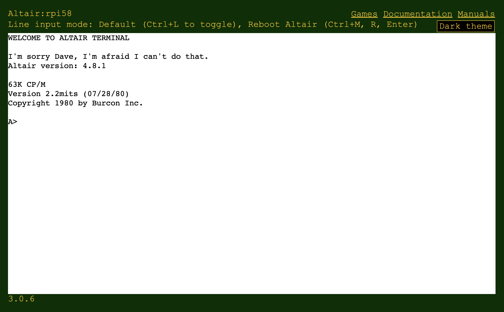

# Add cloud services


## Stop the Altair docker container

First, stop the Altair Docker container. From a terminal window, run the following command.

```bash
docker stop altair8800
```

## Create an environment file

1. Go to the *Altair8800* folder that you cloned to your computer.
1. Using your text editor of your choice create a *altair.env* environment file.
1. Add the following keys to the file:

    ```env
    ID_SCOPE=
    DEVICE_ID=
    DERIVED_KEY=
    OPEN_WEATHER_MAP_API_KEY=
    TZ=Australia/Sydney
    ```

    The ID_SCOPE, DEVICE_ID, and DERIVED_KEY values are used to connect the Altair emulator to Azure IoT Central. The OPEN_WEATHER_MAP_API_KEY value is used to connect the Altair emulator to Open Weather Map. The TZ value is used to set the time zone for the Altair emulator.

1. Remove the keys you don't need. For example, if you don't want to connect to Azure IoT Central then remove the ID_SCOPE, DEVICE_ID, and DERIVED_KEY keys.

1.  Update the values with your data you copied from the [Cloud sevices](../20-fundamentals/40-Cloud-services/01-Add-cloud-services.md) page.

    :::tip

    - If you don't use a service then leave the key-value blank.
    - Don't include any speech marks in key-values.
    - Replace the Australia/Sydney time zone with your local time zone.

    :::


3. Save the file as **~/altair.env**. The commands below assume you have saved the Altair environment file to your computer's home directory.


## Select the Altair Docker image

1. For general use on 64-bit [Linux, macOS, Windows, and Raspberry Pi operating systems](#general-linux-macos-windows-and-raspberry-pi-users). Run the following command.

    ```bash
    docker run -d --env-file ~/altair.env -p 8082:8082 -p 80:80 -v altair-disks:/Altairdocker/AltairHL_emulator/Disks --name altair8800 --rm glovebox/altair8800:latest
    ```

1. For a Raspberry Pi running [Raspberry Pi OS with a Pi Sense HAT](#raspberry-pi-with-pi-sense-hat-users). Run the following command.

    ```bash
    docker run -d --env-file ~/altair.env --privileged -p 8082:8082 -p 80:80 -v altair-disks:/Altairdocker/AltairHL_emulator/Disks --name altair8800 --rm glovebox/altair8800-pisense:latest
    ```

## Open the Web Terminal

Open the Web Terminal to access the Altair emulator. Open your web browser:

 * Navigate to `http://localhost` if you deployed the Altair emulator on your local computer.
 * Navigate to `http://hostname_or_ip_address` if you deployed the Altair emulator on a remote computer.


