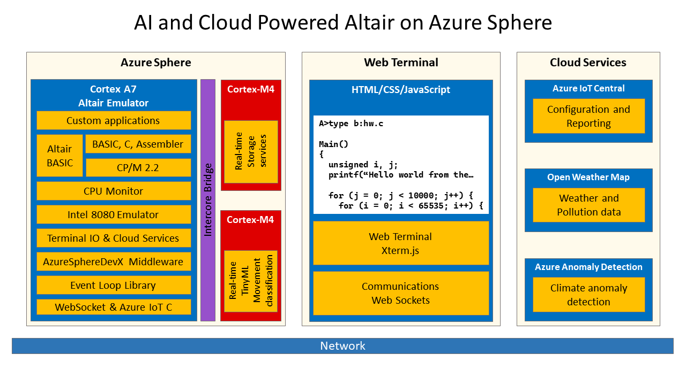

# Architecture

The Altair solution is deployed across all three custom app cores on Azure Sphere, including two workloads on the low-power real-time cores. The Altair emulator runs on the high-level Cortex A7 core, a continuous movement classification TinyML model runs on one of the real-time cores, and the other real-time core runs storage services.

Starting from the bottom left and moving up and then to the right.

- **POSIX Compatible OS:**. The Altair 8800 emulator runs on [POSIX](https://en.wikipedia.org/wiki/POSIX) compatible operating systems, including Linux, macOS, [Windows WSL 2](https://docs.microsoft.com/windows/wsl), and Raspberry Pi OS.
- **WebSocket & Azure IoT C:** These communication libraries connect the Altair emulator to the web terminal and cloud services. The Altair terminal IO messages are routed over [WebSockets](https://en.wikipedia.org/wiki/WebSocket), and the Azure IoT C SDK connects the Altair to Azure IoT Central.
- **Event loop:** The Altair coordinates activities on the main thread using the built-in Event loop library.
- **EdgeDevX:** This library simplifies access to Azure IoT services, and provides event-timer services, along with several useful utilities.
- **Terminal IO & Cloud Services:** The Intel 8080 CPU provides 256 input ports and 256 output ports. The Intel 8080 ports were used to integrate peripherals such as disk drives, printers, and modems. However, for the Altair emulator, these ports are used to integrate communications and cloud services. Terminal input and output ports are routed over WebSockets, other ports are used for timing services, access to weather and pollution data, plus Azure IoT services.
- **Intel 8080 emulator:** This is an open-source software implementation of the Intel 8080 CPU. The Intel 8080 emulator executes Intel 8080 applications including the CP/M operating system, compilers, apps, and games.
- **CPU Monitor:** The CPU monitor implements the virtual Altair front panel, along with memory disassembler, tracer, and Altair emulator reset.
- **CP/M:** CP/M originally stood for Control Program/Monitor. Later, CP/M became known as Control Program for Microcomputers. It was a mass-market operating system created in 1974 for Intel 8080/85-based microcomputers by Gary Kildall of Digital Research, Inc.
- **Programming languages:** Included on the main disk image are the Microsoft BASIC interpreter, the BDS C compiler, and the Intel and Microsoft assemblers and linkers.
- **Altair BASIC:** By default the Altair emulator boots CP/M, but it is easy to boot the original Altair BASIC program.
- **Altair Web Terminal:** Provides a web-browser-hosted Altair terminal. The web terminal is built using the Xterm library. Xterm.js provides a web browser-hosted terminal, a WebSocket integrates Xterm with the Altair emulator.
- **Open Weather Map**: Open Weather Map provides planet-scale weather and pollution data services. Open Weather Map provides free access to weather and pollution data by geographic location.
- **Azure IoT Central:** [Azure IoT Central](https://azure.microsoft.com/services/iot-central?azure-portal=true) is a customizable cloud-based Internet of Things (IoT) application platform. You can report, analyze, and export IoT data.
