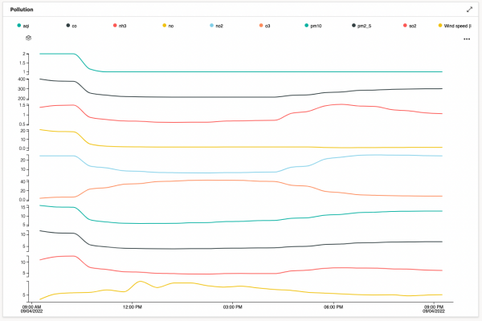
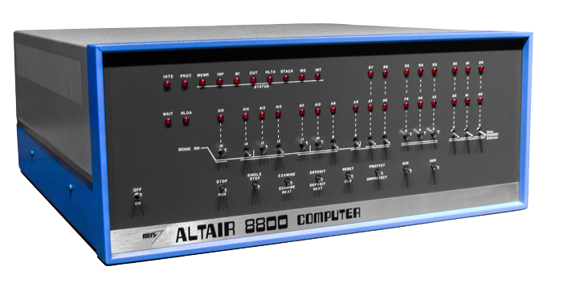

## Introduction

The goal of the cloud-connected Altair project is to provide a unique blend of [computing history](https://en.wikipedia.org/wiki/Retrocomputing) with modern cloud computing. You'll learn about computing fundamentals, software development, and modern IoT, Data, and AI cloud services that address today's real-world IT challenges.

The [Altair 8800](https://en.wikipedia.org/wiki/Altair_8800?azure-portal=true) kick-started the personal computer revolution. Microsoft's first product was [Altair BASIC](https://en.wikipedia.org/wiki/Altair_BASIC?azure-portal=true) written for the Altair 8800 by Bill Gates and Paul Allen. At the time, Altair BASIC was a huge step forward as it allowed people to write programs using a high-level programming language.

## Get started docs

Head to [Get started](/start/Deploy) to learn how to deploy and run the Altair 8800 emulator.

## Retro computing with Dave Glover and the Altair 8800

<iframe width="100%" height="420" src="https://www.youtube.com/embed/fSz5lTaXS0E" title="YouTube video player" frameborder="0" allow="accelerometer; autoplay; clipboard-write; encrypted-media; gyroscope; picture-in-picture" allowfullscreen></iframe>

The Altair project can be viewed through three lenses:

1. Learn how to develop multithreaded event-driven IoT C applications that scale from [microcontrollers](https://en.wikipedia.org/wiki/Microcontroller), to [Raspberry Pis](https://en.wikipedia.org/wiki/Raspberry_Pi), to desktop-class computers.
1. A fantastic safe way to explore machine-level programming, Intel 8080 Assembly programming, along with C and BASIC development.
1. You are interested in retro gaming, and you want to chill playing retro games from yesteryear.
1. Optionally, the project integrates free weather and pollution cloud services from [Open Weather Map](http://openweathermap.org), along with [Azure IoT Central](https://azure.microsoft.com/en-au/services/iot-central/), and [Azure Anomaly Detection Cognitive Service](https://azure.microsoft.com/services/cognitive-services/anomaly-detector/). The following reports were generated from data published by the Altair emulator using data sourced from Open Weather Map.

| IoT Central Sydney pollution report | Azure Anomaly Detection report|
|------|-----|
|  |  |

<!-- ## Test drive the Altair in the cloud

The **easiest** way to try the Altair emulator is from your web browser. Select the following link, [Test Drive the Altair 8800 emulator](http://aterminal.z8.web.core.windows.net/?altair=altair.westus2.cloudapp.azure.com), and open the link in a new browser tab. The Altair web terminal will open, select **Connect** to start a 30-minute session. The web terminal connects to an instance of the emulator running in an [Azure Container Instance](https://azure.microsoft.com/services/container-instances/).

Then learn about [CPM](20-Web-Terminal.md), software development with [BASIC](02-Programming-the-Altair/02-Microsoft-BASIC-programming.md), [C](02-Programming-the-Altair/03-C-programming.md), and [Assembly](02-Programming-the-Altair/04-Assembly-programming.md) using climate data sourced from [Open Weather Map](https://openweathermap.org/). Or take a break, and fire up a [retro game](20-Web-Terminal.md#get-started-with-retro-gaming).

The following limitations apply to test-drive:

1. You'll lose any changes you make when you disconnect or close the test-drive web terminal.
1. Only one person at a time can connect to the test-drive emulator. If you can't connect, then try again in 30-minutes. -->

## Running the Altair

The Altair emulator runs on desktop and device operating systems. The [source code](https://github.com/gloveboxes/Altair8800.Emulator.UN-X) is the same, but on devices there are some extended experiences. The Altair emulator has been tested on the following desktop operating systems and devices.

### Supported operating systems

The **fastest** way to run the Altair emulator is on your computer with Docker. The Altair emulator also runs on [POSIX](https://en.wikipedia.org/wiki/POSIX) compatible operating systems including, Linux, Windows with [WSL 2](https://docs.microsoft.com/en-us/windows/wsl/install), macOS on Apple Silicon and Intel.

### Supported devices

The more **interesting** way to run the Altair emulator is on a device, the Altair emulator has been tested on the following devices:

1. [Raspberry Pi](https://www.raspberrypi.org/), models, Zero 1 & 2, 2B, 3B, 3B, and 4 running Raspberry Pi OS.
1. [Azure Sphere Avnet and Seeed Developer Kits](https://azure.microsoft.com/services/azure-sphere/) running embedded Linux.

#### Raspberry Pi with the optional Pi Sense HAT

If you pair a Raspberry Pi with a [Pi Sense HAT](https://www.raspberrypi.com/products/sense-hat/), the Altair address and data bus activity is displayed on the 8x8 LED panel.

| Raspberry Pi with Pi Sense HAT  | Raspberry Pi Sense HAT |
|--|--|
|  |  |

#### Azure Sphere with optional Altair front panel kit

The Altair emulator is supported on Azure Sphere devices from Avnet and Seeed Studio. If an Azure Sphere device is paired with the [Altair front panel kit](https://github.com/AzureSphereCloudEnabledAltair8800/AzureSphereAltair8800.Hardware) or the [Mikroe Altair Retro Click](https://www.mikroe.com/blog/8800-retro-click), the Altair address and data bus activity is displayed.

| Azure Sphere with the Altair front panel kit | MikroE Retro Click |
|--|--|
|  |  |

## Altair history

[Altair 8800 image attribution - Smithsonian Museum](https://commons.wikimedia.org/wiki/File:Altair_8800,_Smithsonian_Museum.jpg)

The Altair 8800 was built on the [Intel 8080](https://en.wikipedia.org/wiki/Intel_8080?azure-portal=true) CPU, the second 8-bit microprocessor manufactured by Intel in 1974. By today's standards, it's a simple CPU design, perfect for learning computing fundamentals because of its small instruction set.

The original Altair 8800 was programmed by setting switches on the front panel. It was a painstaking, error-prone process to load and run a program. The Altair 8800 had a series of LEDs and switches that you used to load apps and determine the state of the Altair.

You could save and load applications from a paper tape reader connected to the Altair 8800. As the Altair 8800 grew in popularity, more options became available. You could attach a keyboard, a computer monitor, and finally disk drives, a more reliable way to save and load applications.
